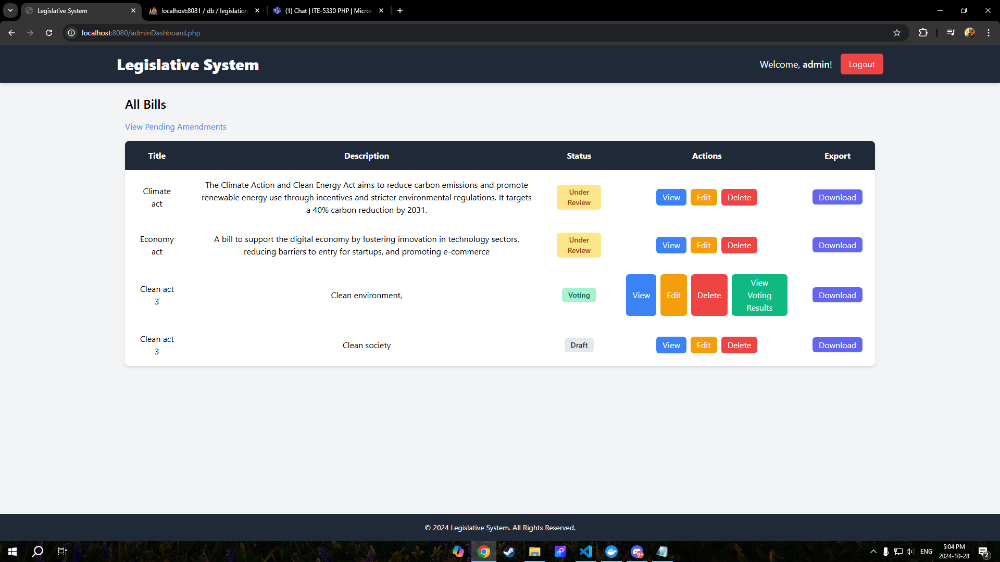
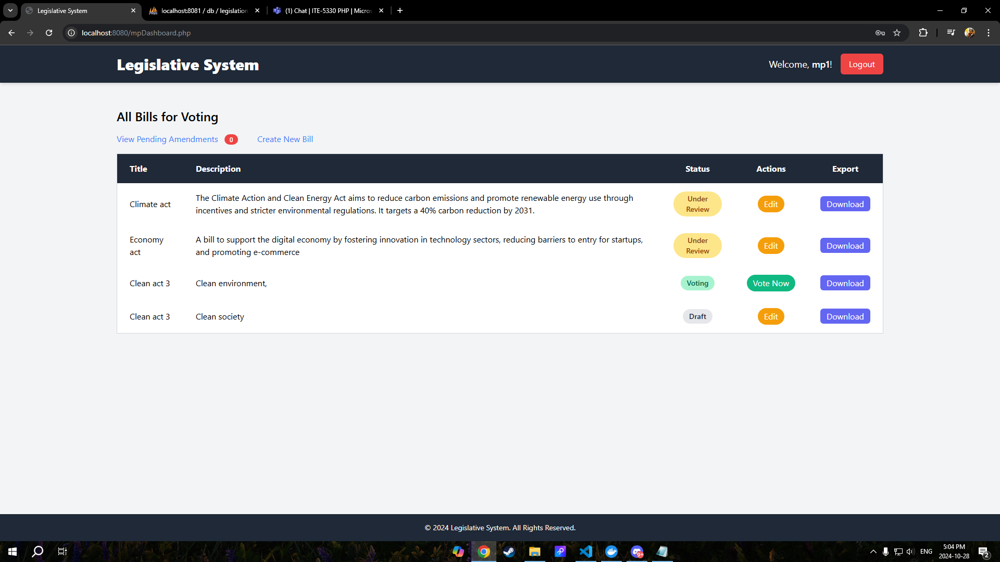
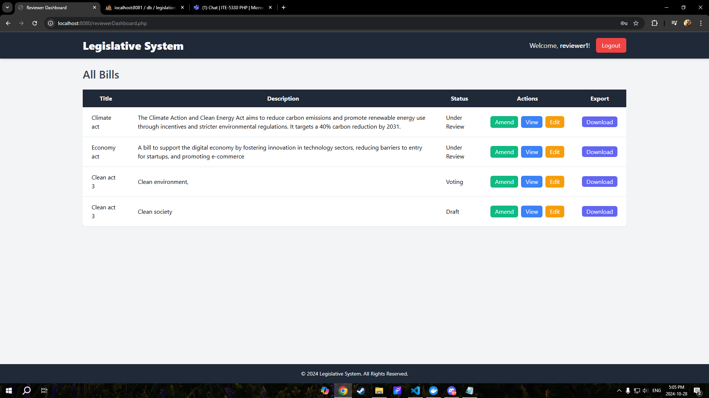
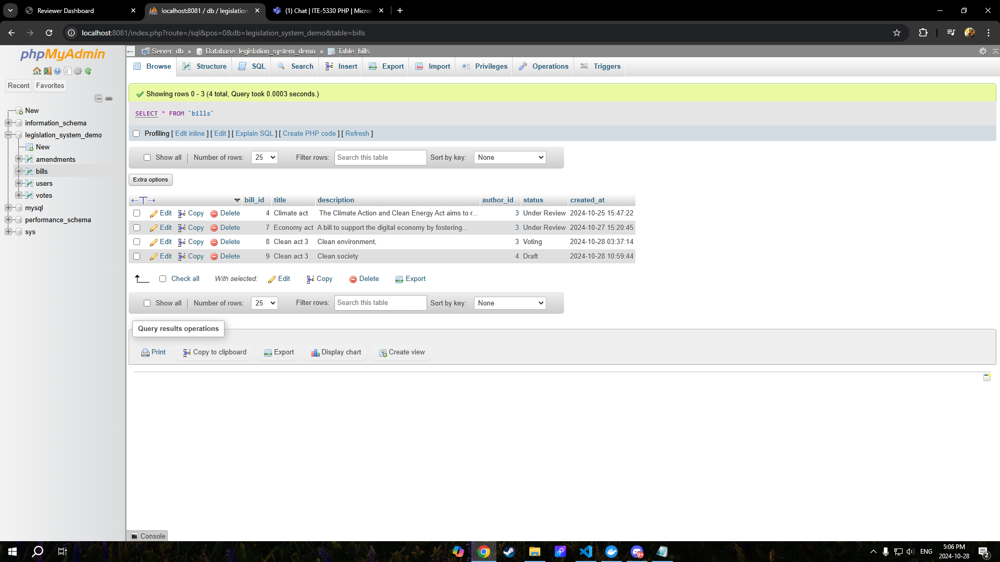
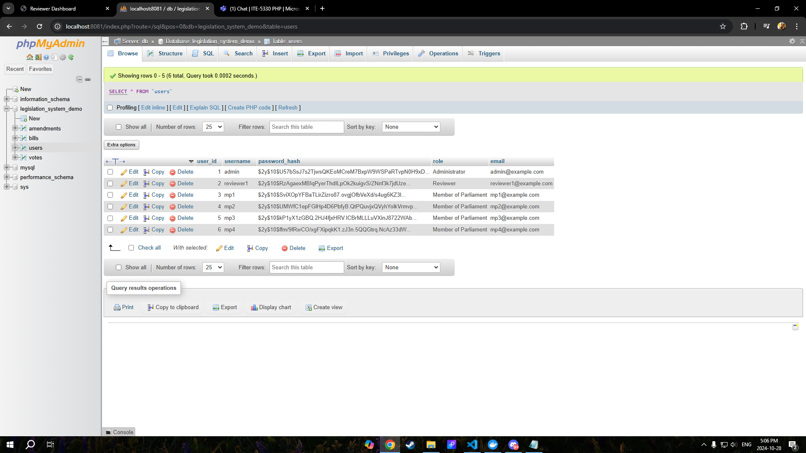
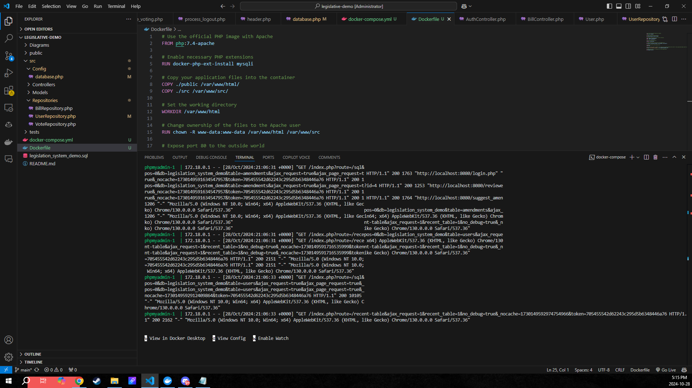
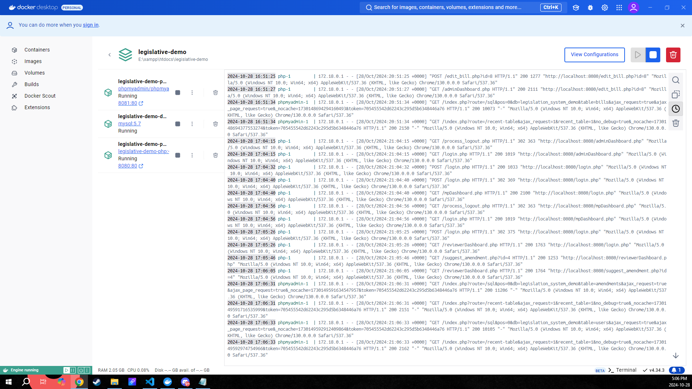
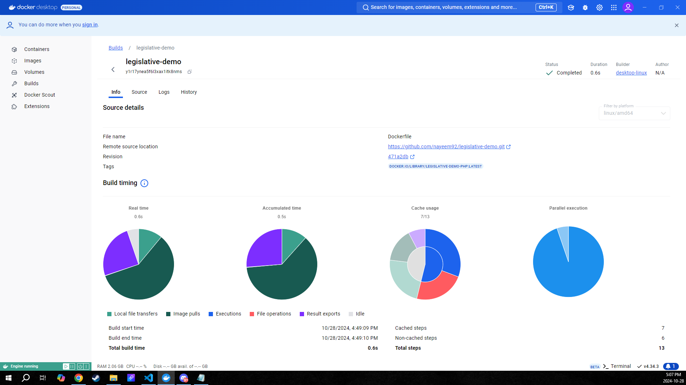
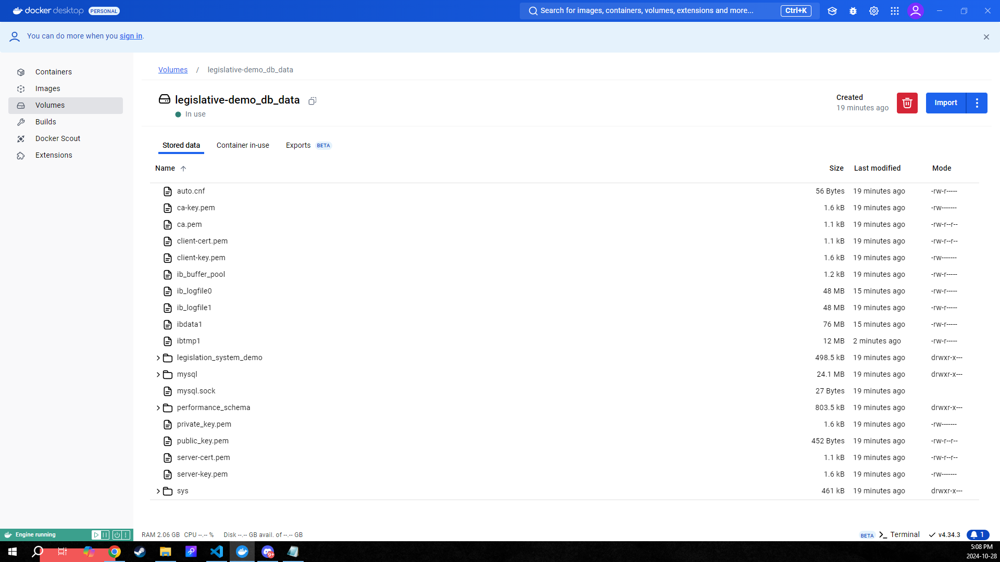

# Legislative System

The **Legislative System** is a web-based application designed to streamline the legislative process. The system allows different types of users — Members of Parliament (MPs), Administrators, and Reviewers — to interact with bills, including creating, editing, voting, reviewing, and managing legislative data. The system includes robust features like data export and status tracking for better governance.

## Project Description

This project aims to provide an intuitive interface for managing legislative processes, with features that support the needs of different roles:

- **Members of Parliament (MPs)** can:
  - Create new bills.
  - Edit and update bills.
  - Vote on bills that are under the voting stage.
  - Download bill data in XML or JSON format.

- **Administrators** can:
  - Manage all the bills created in the system.
  - View and delete bills.
  - See detailed voting results for each bill.
  - Export bill data to XML or JSON format.

- **Reviewers** can:
  - Review and amend bills.
  - Track the status of bills.

## Key Features

- **Role-Based Dashboards**:
  - Tailored dashboards for MPs, Admins, and Reviewers.
  - Clear navigation and action buttons for different tasks.
- **Bill Management**:
  - CRUD (Create, Read, Update, Delete) operations for bills.
  - Role-specific functionalities.
- **Voting**:
  - MPs can vote on bills.
  - Voting results are displayed in a user-friendly format.
- **Data Export**:
  - Bills can be exported in XML or JSON format for archival purposes.
- **Amendment Review**:
  - A streamlined process for reviewers to manage and track amendments.

## Technologies Used

- **PHP**: Server-side scripting for handling backend logic.
- **MySQL**: Relational database to store legislative data and user information.
- **Tailwind CSS**: A modern utility-first CSS framework for styling.
- **JavaScript**: Used for client-side interactions.
- **Composer**: Dependency management for PHP.

## Prerequisites

- **PHP** 8.2 or above.
- **MySQL Database**.
- **Apache Web Server** (XAMPP or similar).
- **Composer** for dependency management.

## Installation

### Option 1: Docker Setup

#### Step 1: Clone the Repository
```bash
git clone https://github.com/nayeem92/legislative-demo.git
cd legislative-demo
```

#### Step 2: Run Docker

- Ensure Docker is running on your system.
- Start the Docker containers:
  ```bash
  docker-compose up -d
  ```

#### Step 3: Access the Application

- Open your browser and navigate to [http://localhost:8080](http://localhost:8080).

#### Screenshot Reference






#### Step 3: Access phpMyAdmin

- Open your browser and navigate to [http://localhost:8081](http://localhost:8081).


#### Screenshot Reference





#### Database Configuration:
- In the Docker environment, set `DB_HOST` to `db` in `database.php` to connect to the MySQL container.

### Option 2: Local XAMPP/WAMP Setup

#### Step 1: Clone the Repository
```bash
git clone https://github.com/nayeem92/legislative-demo.git
cd legislative-demo
```

#### Step 2: Install Dependencies
```bash
composer install
```

#### Step 3: Database Setup

- Open PHPMyAdmin (usually at [http://localhost/phpmyadmin](http://localhost/phpmyadmin)) and create a new database named `legislation_system_demo`.
- Import the `legislation_system_demo.sql` file to set up initial tables and data.

#### Step 4: Run the Application

- Start XAMPP/WAMP and ensure Apache and MySQL are running.
- Open your browser and go to [http://localhost/legislative-system/public](http://localhost/legislative-system/public) (assuming the `legislative-system` folder is in your `htdocs` directory).

#### Database Configuration:
- When using XAMPP/WAMP, set `DB_HOST` to `localhost` in `database.php`.

## User Credentials

Below are the default usernames and passwords for testing the system:

### Members of Parliament (MPs)
- **MP1**:
  - Username: `mp1`
  - Password: `mp1_password`
- **MP2**:
  - Username: `mp2`
  - Password: `mp2_password`
- **MP3**:
  - Username: `mp3`
  - Password: `mp3_password`
- **MP4**:
  - Username: `mp4`
  - Password: `mp4_password`

### Administrator
- **Admin**:
  - Username: `admin`
  - Password: `admin_password`

### Reviewer
- **Reviewer1**:
  - Username: `reviewer1`
  - Password: `reviewer_password`


## Docker Desktop







# Preparations Before Creating the EC2 Instance

### 1. Dockerize the PHP Application
A Dockerfile was created for the PHP application to set up the environment, including necessary PHP extensions and copying application files.

### 2. Building the Docker Image
The PHP application Docker image was built using the command:

```bash
docker build -t legislative-demo-php:latest .
```
### 3. Creating Docker Compose File
A docker-compose.yml file was defined that specifies:

- PHP Service: Builds from the Dockerfile.

- MySQL Service: Uses the mysql:5.7 image with environment configurations.

- phpMyAdmin Service: Uses the phpmyadmin/phpmyadmin image.

This setup ensures that when docker-compose up is run, Docker Compose will automatically pull the required images if they are not already present on the local machine.

### 4. Pulling MySQL and phpMyAdmin Images
Instead of tagging and pushing the MySQL and phpMyAdmin images to the ECR repository, these images can be pulled directly from Docker Hub using:

```bash
docker pull mysql:5.7
docker pull phpmyadmin/phpmyadmin
```
### 5. Tagging the PHP Image for ECR
After building the PHP application image, the image was tagged to prepare it for pushing to the ECR repository:

```bash
docker tag legislative-demo-php:latest public.ecr.aws/ACCOUNT_ID/my-php-repository:latest
```
### 6. Pushing the PHP Image to ECR
The tagged PHP image was pushed to the Amazon ECR repository using:

```bash
docker push public.ecr.aws/ACCOUNT_ID/my-php-repository:latest
```
These steps ensured that the Docker images were prepared and available in ECR for deployment on the EC2 instance.

# Dockerized PHP Application Deployment on AWS EC2

## Prerequisites
- AWS Account
- Docker installed locally
- ECR repositories for your PHP image already set up

## Steps to Launch EC2 and Deploy the Application

### 1. Launch an EC2 Instance

- **Sign in** to your AWS Management Console.
- Navigate to **EC2 Dashboard**.
- Click on **Launch Instance**.
- Choose an Amazon Machine Image (AMI), such as **Amazon Linux 2**.
- Select an instance type, such as **t2.micro** (within the free tier).
- Configure instance details, such as VPC and subnet.
- Add storage if needed (default settings are usually fine).
- Configure security group:
  - Allow HTTP (port 80) and HTTPS (port 443) access.
  - Allow custom TCP rules for the application (e.g., port 8080 for PHP, port 8081 for phpMyAdmin).
- Review and launch the instance. **Download the key pair** for SSH access.

### 2. Connect to Your EC2 Instance

- Open a terminal and connect using SSH:
  ```bash
  ssh -i /path/to/your-key.pem ec2-user@your-ec2-instance-public-dns


### 3. User Data Script for Docker and Application Setup
When launching the EC2 instance, provide a user data script to automate the installation of Docker, set up your application, and pull your Docker images from ECR:
  ```bash
#!/bin/bash
# Update package information
yum update -y

# Install Docker
yum install -y docker

# Start the Docker service
service docker start

# Add ec2-user to the Docker group (optional)
# usermod -aG docker ec2-user

# Verify Docker Installation
docker --version

# Create project directory
mkdir -p /home/ec2-user/my-docker-project

# Pull your PHP Docker image from ECR
docker pull public.ecr.aws/i1u5x0h8/my-php-repository:latest

# Create docker-compose.yml file
cat <<EOL > /home/ec2-user/my-docker-project/docker-compose.yml
version: '3.8'

services:
  php:
    image: public.ecr.aws/i1u5x0h8/my-php-repository:latest
    container_name: php-container
    ports:
      - "8080:80"
    depends_on:
      - db

  db:
    image: mysql:5.7            # Use MySQL 5.7 from Docker Hub
    container_name: mysql-container
    environment:
      MYSQL_DATABASE: legislation_system_demo
      MYSQL_ALLOW_EMPTY_PASSWORD: "yes"
      MYSQL_ROOT_PASSWORD: ""
    volumes:
      - db_data:/var/lib/mysql
      - ./legislation_system_demo.sql:/docker-entrypoint-initdb.d/init.sql

  phpmyadmin:
    image: phpmyadmin/phpmyadmin  # Use phpMyAdmin from Docker Hub
    container_name: phpmyadmin-container
    ports:
      - "8081:80"
    environment:
      PMA_HOST: db
      PMA_USER: root
      PMA_PASSWORD: ""

volumes:
  db_data:
EOL

```

###  4. Install Docker Compose
After the EC2 instance setup, install Docker Compose:
  ```bash
# Install Docker Compose
curl -L "https://github.com/docker/compose/releases/download/$(curl -s https://api.github.com/repos/docker/compose/releases/latest | grep -oP '"tag_name": "\K(.*)(?=")')" -o /usr/local/bin/docker-compose
chmod +x /usr/local/bin/docker-compose

# Verify Docker Compose Installation
docker-compose --version
```

### 5. Start the Application
Navigate to the project directory and start the containers using Docker Compose:
```bash
# Navigate to the project directory
cd /home/ec2-user/my-docker-project

# Run Docker Compose to start the containers
docker-compose up -d
```

### 6. Accessing Your Application
After the containers are running, access your application:

PHP Application: http://your-ec2-instance-public-dns:8080

phpMyAdmin: http://your-ec2-instance-public-dns:8081

### 7. Managing Your Application
To view logs for any of the services:

```bash
docker-compose logs php
docker-compose logs db
docker-compose logs phpmyadmin
```

To stop the services:
```bash
docker-compose down
```

### 8. Importing the Database

If you notice that the database is missing after deployment, you can easily restore it by importing the `legislation_system_demo.sql` file using phpMyAdmin. Follow these steps:

 **Access phpMyAdmin**:
   - Open your web browser and navigate to:  
     `http://<your-ec2-public-ip>:8081`

 **Log In**:
   - Use the following credentials to log in:
     - **Username**: `root`
     - **Password**: *(leave this field empty)*

 **Select the Database**:
   - From the left sidebar, click on the database named `legislation_system_demo`.

 **Import the SQL File**:
   - Click on the **Import** tab at the top.
   - Choose the `legislation_system_demo.sql` file from your local machine and upload it to restore your database.

This process will ensure your database is set up correctly after deployment.


